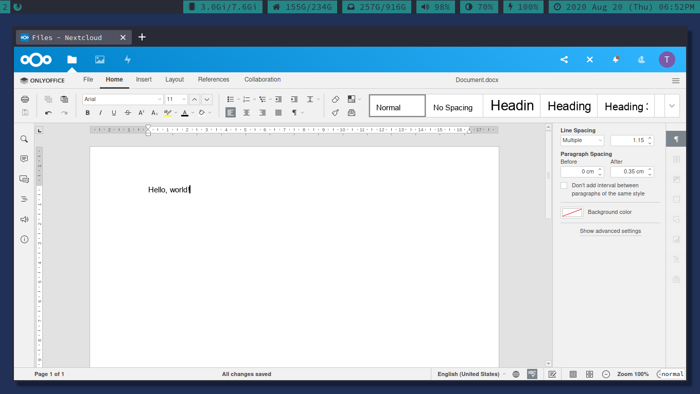
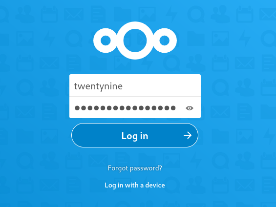
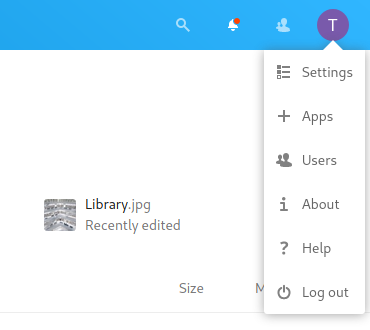
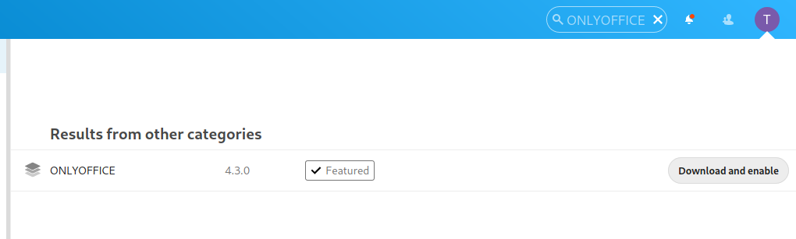
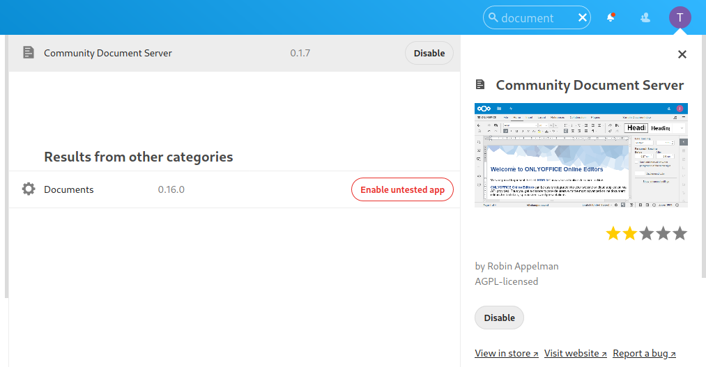
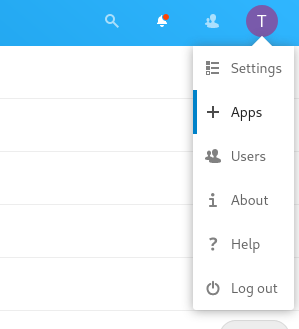
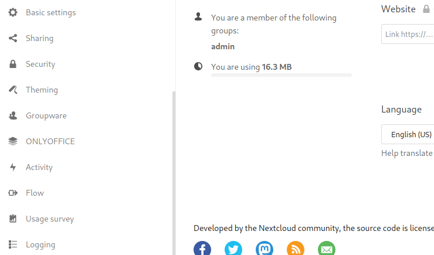
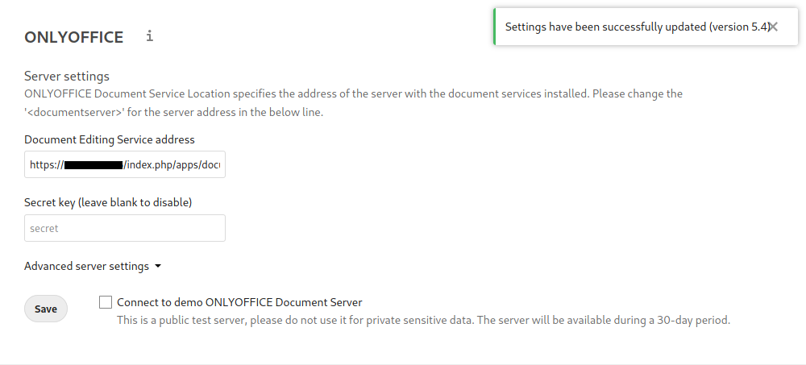

# Table of Contents

1.  [Instalação](#orgdcd4f73)
    1.  [Nextcloud](#orgb55b0c1)
        1.  [Conta de administrador](#org1ef4192)
        2.  [Trusted Domains](#org34b0a13)
        3.  [SSL para Nextcloud Web Interface](#orgf3d994a)
        4.  [Acessando a Nextcloud Web Interface](#orgaf977f0)
    2.  [ONLYOFFICE](#orgb1f55c9)

O objetivo deste projeto é criar um ambiente privado de armazenamento e edição de documentos online.  
Para isso, usamos o [Nextcloud](https://nextcloud.com/) como a base para a nossa plataforma, com uma integração ao [ONLYOFFICE](https://www.onlyoffice.com/) para a engrenagem da nossa office suite.  

  

# Instalação

Vamos proceder assumindo que estamos usando uma máquina virtual da AWS com Ubuntu 20.04.1 LTS (GNU/Linux 5.4.0-1021-aws x86\_64) através de uma conexão por ssh.  

## Nextcloud

Usamos o [Snap](https://en.wikipedia.org/wiki/Snap_(package_manager)) packaging system para a instalação. Com isso, podemos apenas instalar o software sem nos preocuparmos com a configuração manual de um servidor web e de base de dados.  

Para baixar o Nextcloud através do snap, fazemos:  

    $ sudo snap install nextcloud

Se queremos verificar que o pacote foi instalado corretamente:  

    $ snap changes nextcloud

As colunas `Status` e `Summary` do output indicam se a instalação foi bem sucedida.  

    ID   Status  Spawn               Ready               Summary
    2    Done    today at 16:12 UTC  today at 16:12 UTC  Install "nextcloud" snap

### Conta de administrador

Podemos criar uma conta de administrador com username "twentynine" e senha "password" através da linha de comando:  

      $ sudo nextcould.manual-install twentynine password
    Nextcloud is not installed - only a limited number of commands are available
    Nextcloud was successfully installed

Este output indica que a configuração foi feita corretamente.  

### Trusted Domains

Ao instalar pela linha de comando, o Nextcloud limita os host names aos quais ele irá responder.  
Como iremos acessar o Nextcloud pelo IP da VM, adicionar o IP à lista de `trusted_domains`.  

Para ver a configuração atual de trusted domains:  

      $ sudo nextcloud.occ config:system:get trusted_domains
    localhost

Podemos ver que apenas, por default, apenas o nome "localhost" está registrado.  

Adicionamos o IP do servidor ("1.1.1.1", por exemplo) à posição 1 da lista de `trusted_domains`:  

      $ sudo nextcloud.occ config:system:set trusted_domains 1 --value=1.1.1.1
    System config value trusted_domains => 1 set to string example.com 

Para confirmar, rodamos mais uma vez:  

      $ sudo nextcloud.occ config:system:get trusted_domains
    localhost
    1.1.1.1

E confirmamos que o IP foi adicionado corretamente.  

### SSL para Nextcloud Web Interface

Para estabelecer um nível de segurança, usamos um **self-signed SSL certificate**, que irá encriptar o trafego web porém sem poder verificar a identidade do nosso servidor.  

      $ sudo nextcloud.enable-https self-signed
    Output
    Generating key and self-signed certificate... done
    Restarting apache... done

Agora que a interface está segura, podemos abrir as portas no firewall para permitir acessos.  

    sudo ufw allow 80,443/tcp

**OBS.:** Este passo também deverá ser feito através da própria AWS.  

### Acessando a Nextcloud Web Interface

Abrimos um browser e acessamos através do url:  

    https://1.1.1.1

Onde "1.1.1.1" deve ser substituido pelo IP do servidor.  

Após sermos direcionados à página de login, inserimos as credenciais criadas para a nossa conta de administrador:  
  

## ONLYOFFICE

A instalação do ONLYOFFICE e sua integração com o Nextcloud será feita inteiramente dentro da interface web que acabamos de definir.  

Para acessar a central de aplicativos do Nextcloud à partir da tela inicial, selecionamos o menu no topo direito da interface e clicamos em "Apps":  
  

Procuramos por "ONLYOFFICE" e clicamos em "Download and enable":  
  

Precisamos repedir o último passo para instalar o "Community Document Server":  
  

Agora vamos acessar a página de configuração. Abrimos o mesmo menu no topo direito da interface e clicamos em "Settings":  
  

Na barra esquerda, desca até ver a seção do ONLYOFFICE e clique nela:  
  

Finalmente, na tela de configuração do ONLYOFFICE, verifique que o campo "Document Editing Service address" contém um url e clique em "Save".  
Uma mensagem de confirmação irá aparecer no canto superior direito da interface:  
  

Agora podemos acessar nossos documentos na página inicial da nossa interface Nextcloud e editar usando o ONLYOFFICE!  

